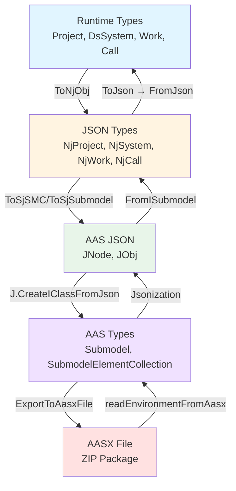

# Ev2.Aas.FS Class Diagram

이 문서는 Ev2.Aas.FS 프로젝트의 AAS 통합 구조를 보여줍니다.

## 프로젝트 개요

Ev2.Aas.FS는 Ev2.Core.FS의 도메인 객체를 AAS (Asset Administration Shell) 표준 형식으로 변환하는 라이브러리입니다.

### 주요 기능
- **Core → AAS 변환**: Runtime 객체를 AAS Submodel로 직렬화
- **AAS → Core 변환**: AAS Submodel을 Runtime 객체로 역직렬화
- **AASX 파일 처리**: AASX (ZIP 패키지) 파일 생성/읽기/업데이트
- **의미론적 ID 관리**: URL 기반 semantic ID 매핑

## 아키텍처 개요



## 주요 컴포넌트

### 1. AAS 외부 라이브러리 (AasCore.Aas3_0)

Industry 4.0 표준 AAS 3.0 구현체:

- **Environment**: AASX 파일의 최상위 컨테이너
- **Submodel**: 실제 데이터를 담는 서브모델
- **SubmodelElementCollection**: 구조화된 데이터 컬렉션
- **Property**: 단일 속성 값

### 2. AAS Semantics (의미론적 ID 관리)

```fsharp
module AasSemantics =
    let map : Dictionary<string, string> = [
        ("Project",  "https://dualsoft.com/aas/project")
        ("System",   "https://dualsoft.com/aas/system")
        ("Work",     "https://dualsoft.com/aas/singular/work")
        ("ApiDef",   "https://dualsoft.com/aas/singular/apiDef")
        // ... 기타 매핑
    ] |> Tuple.toDictionary
```

**목적**: AAS 요소에 고유한 의미론적 식별자 부여

### 3. JSON 확장 모듈

#### 열거형 타입
- **Category**: PARAMETER, CONSTANT, VARIABLE
- **ModelType**: Property, Submodel, SubmodelElementCollection 등
- **SemanticIdType**: ExternalReference, GlobalReference, ModelReference
- **KeyType**: ConceptDescription, Property, Submodel 등
- **KindType**: Template, Instance

#### JsonObject 확장 메서드
```fsharp
type System.Text.Json.Nodes.JsonObject with
    member x.Set(key: N, value: string): JObj
    member x.SetTypedValue<'T>(value: 'T): JObj option
    member x.SetSemantic(semanticKey: string): JObj
    member x.TrySetProperty<'T>(value, name, ?counters): JObj option
    member x.AddProperties(?category, ?semanticKey, ?modelType, ...): JObj
    member x.ToSjSMC(semanticKey: string, values: JNode seq): JObj
```

#### JSON 헬퍼 클래스 (J)
```fsharp
[<AbstractClass; Sealed>]
type J() =
    static member CreateJArr(jns: JNode seq): JArr
    static member CreateIClassFromJson<'T when 'T :> IClass>(json: string): 'T
    static member CreateIClassFromXml<'T when 'T :> IClass>(xml: string): 'T
```

### 4. Core → AAS 변환 (Serialization)

각 NjXXX 타입에 대한 확장 메서드:

```fsharp
type NjProject with
    member x.ToSjSMC(): JNode
    member x.ToSjSubmodel(): JNode

type NjSystem with
    member x.ToSjSMC(): JNode

type NjWork with
    member x.ToSjSMC(): JNode

type NjCall with
    member x.ToSjSMC(): JNode
```

**명명 규칙**:
- `ToSjSMC`: **To [S]ystem [J]son [S]ub[M]odel element [C]ollection**
- `ToSjSubmodel`: **To [S]ystem [J]son Submodel**

#### 속성 수집 패턴
```fsharp
type NjUnique with
    member x.CollectProperties(): JNode[] =
        seq {
            // 기본 속성
            yield! x.tryCollectPropertiesNjUnique()

            // 확장 속성 (TypeFactory 통한 확장 지원)
            yield! x.tryCollectExtensionProperties()

            // 타입별 특수 속성
            match x with
            | :? NjProject as prj -> ...
            | :? NjSystem as sys -> ...
            | :? NjWork as work -> ...
            | :? NjCall as call -> ...
        } |> choose id |> toArray
```

### 5. AAS → Core 변환 (Deserialization)

AASX 파일이나 AAS Submodel로부터 NjXXX 객체 생성:

```fsharp
type NjProject with
    static member FromAasxFile(aasxPath: string): NjProject
    static member FromISubmodel(submodel: ISubmodel): NjProject

type NjSystem with
    static member FromSMC(smc: SubmodelElementCollection): NjSystem

type NjWork with
    static member FromSMC(smc: SubmodelElementCollection): NjWork

type NjCall with
    static member FromSMC(smc: SubmodelElementCollection): NjCall
```

#### SubmodelElementCollection 확장
```fsharp
type SubmodelElementCollection with
    member smc.ReadUniqueInfo(): UniqueInfo
    member smc.GetPropValue(key: string): string
    member smc.TryGetPropValue(key: string): string option
    member smc.GetSMC(semanticKey: string): SubmodelElementCollection[]
    member smc.TryFindChildSMC(semanticKey: string): SubmodelElementCollection option
```

### 6. AASX 파일 처리

#### NjProject AASX 확장
```fsharp
type NjProject with
    member x.ToENV(): Environment
    member x.ToAasJsonStringENV(): string
    member x.ExportToAasxFile(outputPath: string): unit
    member x.InjectToExistingAasxFile(aasxPath: string): unit
```

#### Project AASX 확장
```fsharp
type Project with
    static member FromAasxFile(aasxPath: string): Project
    member x.ExportToAasxFile(outputPath: string, ?dbApi: DbApi): unit
    member x.InjectToExistingAasxFile(aasxPath: string): unit
    member x.UpdateDbAasXml(aasxPath: string, dbApi: DbApi): unit
    member x.ReadRuntimeDataFromDatabase(dbApi: DbApi): unit
```

#### AASX 파일 구조
```
AASX (ZIP)
├── [Content_Types].xml         # MIME 타입 정의
├── _rels/
│   └── .rels                   # 최상위 관계 정의
├── aasx/
│   ├── aasx-origin             # 원본 표시 (빈 파일)
│   ├── _rels/
│   │   └── aasx-origin.rels    # AAS XML 관계 정의
│   └── aas/
│       └── aas.aas.xml         # 실제 AAS XML 데이터
```

#### AasXModule 저수준 처리
```fsharp
module AasXModule =
    let readEnvironmentFromAasx(aasxPath: string): AasFileInfo
    let getAasXmlFromAasxFile(aasxPath: string): string
    let createUpdatedAasxFile(originalPath, xmlPath, env): string
    let replaceFileWithBackup(targetPath, sourcePath): unit
    let updateSubmodels(env, newSubmodel): ISubmodel list
```

## 변환 흐름

### Serialization (직렬화)
```
1. Project/DsSystem (Runtime Type)
   ↓ ToNjObj()
2. NjProject/NjSystem (JSON Type)
   ↓ ToSjSubmodel() / ToSjSMC()
3. JNode/JObj (AAS JSON)
   ↓ J.CreateIClassFromJson<Submodel>()
4. Submodel (AAS Type)
   ↓ ExportToAasxFile()
5. AASX File (ZIP Package)
```

### Deserialization (역직렬화)
```
1. AASX File (ZIP Package)
   ↓ readEnvironmentFromAasx()
2. Environment → Submodel (AAS Type)
   ↓ FromISubmodel()
3. NjProject (JSON Type)
   ↓ ToJson() → Project.FromJson()
4. Project (Runtime Type)
```

## 주요 설계 패턴

### 1. Extension Method Pattern
F# type extensions로 기존 타입에 새로운 메서드 추가:
```fsharp
type NjProject with
    member x.NewMethod() = ...

type SubmodelElementCollection with
    member x.GetSMC(key) = ...
```

### 2. Semantic ID Mapping
의미론적 URL 기반 식별:
```fsharp
let semanticId = AasSemantics.map.["Project"]
// → "https://dualsoft.com/aas/project"
```

### 3. Triple Conversion Chain
Runtime ↔ JSON ↔ AAS 3단계 변환:
```fsharp
// Runtime → JSON → AAS
project.ToNjObj().ToSjSubmodel()

// AAS → JSON → Runtime
NjProject.FromISubmodel(submodel).ToJson() |> Project.FromJson
```

### 4. SubmodelElementCollection 패턴
계층적 데이터 구조를 SMC(SubmodelElementCollection)로 표현:

```fsharp
// 직렬화
member x.ToSjSMC(): JNode =
    let children = x.Children |-> _.ToSjSMC()
    JObj().ToSjSMC("ParentName", x.CollectProperties())
    |> _.AddValues(children)

// 역직렬화
static member FromSMC(smc: SubmodelElementCollection): NjType =
    let children = smc.GetSMC "ChildName" >>= (_.GetSMC("ChildType")) |-> NjChild.FromSMC
    NjType.Create(..., Children = children)
```

### 5. TypeFactory 확장 지원
Third Party 확장 속성 처리:
```fsharp
member x.tryCollectExtensionProperties(): JObj option seq =
    getTypeFactory()
    |-> (fun factory -> factory.WriteAasExtensionProperties x |-> Some)
    |? Seq.empty
```

## C# 상호운용성

F# 확장 메서드를 C#에서 접근 가능하도록 wrapping:

```fsharp
namespace Dual.Ev2.Aas
open System.Runtime.CompilerServices

type Ev2AasExtensionForCSharp =
    [<Extension>]
    static member CsExportToAasxFile(project: Project, outputPath: string): unit =
        project.ExportToAasxFile(outputPath)
```

## 사용 예시

### AASX 파일 내보내기
```fsharp
let project: Project = ...
project.ExportToAasxFile("output.aasx")
```

### AASX 파일 읽기
```fsharp
let project = Project.FromAasxFile("input.aasx")
```

### 기존 AASX 파일 업데이트
```fsharp
let project: Project = ...
project.InjectToExistingAasxFile("existing.aasx")
```

### JSON → AAS 변환
```fsharp
let njProject: NjProject = ...
let submodelJson = njProject.ToSjSubmodel().Stringify()
let submodel = J.CreateIClassFromJson<Submodel>(submodelJson)
```

## 의존성

### 외부 라이브러리
- **AasCore.Aas3_0**: AAS 3.0 표준 구현 (C# 라이브러리)
- **System.Text.Json**: JSON 처리
- **System.IO.Compression**: ZIP 압축/해제

### 내부 프로젝트
- **Ev2.Core.FS**: 도메인 모델 및 JSON 직렬화
- **Dual.Common.Base**: 공통 유틸리티
- **Dual.Common.Core.FS**: 함수형 프로그래밍 헬퍼

## 주요 특징

- ✅ **AAS 3.0 표준 준수**: Industry 4.0 표준 완벽 지원
- ✅ **의미론적 ID**: URL 기반 semantic ID로 명확한 식별
- ✅ **계층적 구조**: SubmodelElementCollection으로 복잡한 구조 표현
- ✅ **확장성**: TypeFactory를 통한 Third Party 확장 지원
- ✅ **양방향 변환**: Runtime ↔ AAS 완벽한 왕복 변환
- ✅ **AASX 패키징**: ZIP 기반 표준 패키지 형식 지원
- ✅ **C# 호환**: F# 타입 확장을 C#에서도 사용 가능

## 관련 문서

- [Ev2.Core.FS 클래스 다이어그램](../Ev2.Core.FS/ClassDiagram.md)
- [AAS 문법 가이드](AasSyntax.md)
