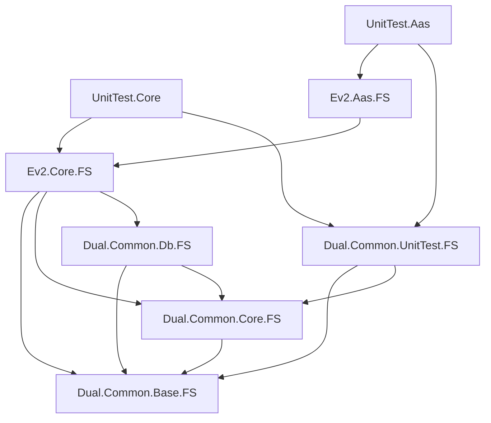

# dsev2 Solution

## 솔루션 개요

**dsev2**는 Dual Inc.의 차세대 자동화 시스템 엔진으로, 산업 자동화 시스템의 디지털 트윈 구현을 위한 포괄적인 프레임워크입니다.

- **이름**: dsev2 (DS Engine Version 2)
- **프로젝트 수**: 8개 (6개 라이브러리 + 2개 유닛 테스트)
- **생성일**: 2025-08-28
- **프레임워크**: .NET 9.0 / .NET Standard 2.0
- **주요 언어**: F# 9.0

## 프로젝트 구조

```
dsev2/
├── src/
│   ├── dsev2.sln
│   ├── engine/
│   │   ├── Ev2.Core.FS/
│   │   │   └── Ev2.Core.FS.fsproj
│   │   └── Ev2.Aas.FS/
│   │       └── Ev2.Aas.FS.fsproj
│   └── unit-test/
│       ├── UnitTest.Core/
│       │   └── UnitTest.Core.fsproj
│       └── UnitTest.Aas/
│           └── UnitTest.Aas.fsproj
└── submodules/
    └── nuget/
        └── Common/
            ├── Dual.Common.Base.FS/
            │   └── Dual.Common.Base.FS.fsproj
            ├── Dual.Common.Core.FS/
            │   └── Dual.Common.Core.FS.fsproj
            ├── Dual.Common.Db.FS/
            │   └── Dual.Common.Db.FS.fsproj
            └── Dual.Common.UnitTest.FS/
                └── Dual.Common.UnitTest.FS.fsproj
```

## 프로젝트 목록

### 1. Dual.Common.Base.FS
- **타입**: F# Library
- **프레임워크**: netstandard2.0
- **역할**: 기본 유틸리티, 인터페이스, JSON 직렬화
- **문서**: [../../submodules/nuget/Common/Dual.Common.Base.FS/Dual.Common.Base.FS.md](../../submodules/nuget/Common/Dual.Common.Base.FS/Dual.Common.Base.FS.md)

### 2. Dual.Common.Core.FS
- **타입**: F# Library
- **프레임워크**: netstandard2.0
- **역할**: 애드혹 다형성, 계산 표현식, 타입 확장
- **문서**: [../../submodules/nuget/Common/Dual.Common.Core.FS/Dual.Common.Core.FS.md](../../submodules/nuget/Common/Dual.Common.Core.FS/Dual.Common.Core.FS.md)

### 3. Dual.Common.Db.FS
- **타입**: F# Library
- **프레임워크**: netstandard2.0
- **역할**: 다중 데이터베이스 지원 (SQLite, PostgreSQL, SQL Server)
- **문서**: [../../submodules/nuget/Common/Dual.Common.Db.FS/Dual.Common.Db.FS.md](../../submodules/nuget/Common/Dual.Common.Db.FS/Dual.Common.Db.FS.md)

### 4. Ev2.Core.FS
- **타입**: F# Library
- **프레임워크**: netstandard2.0
- **역할**: 핵심 도메인 모델, 비즈니스 로직, 데이터베이스 연동
- **문서**: [engine/Ev2.Core.FS/Ev2.Core.FS.md](engine/Ev2.Core.FS/Ev2.Core.FS.md)

### 5. Ev2.Aas.FS
- **타입**: F# Library
- **프레임워크**: net9.0
- **역할**: AAS 3.0 표준 구현, AASX 패키지 처리
- **문서**: [engine/Ev2.Aas.FS/Ev2.Aas.FS.md](engine/Ev2.Aas.FS/Ev2.Aas.FS.md)

### 6. Dual.Common.UnitTest.FS
- **타입**: F# Test Library
- **프레임워크**: net7.0, net8.0, net9.0
- **역할**: 테스트 유틸리티, FsUnit/xUnit 어설션
- **문서**: [../../submodules/nuget/Common/Dual.Common.UnitTest.FS/Dual.Common.UnitTest.FS.md](../../submodules/nuget/Common/Dual.Common.UnitTest.FS/Dual.Common.UnitTest.FS.md)

### 7. UnitTest.Core
- **타입**: F# Test Project
- **프레임워크**: net9.0
- **역할**: Ev2.Core.FS 유닛 테스트
- **문서**: [unit-test/UnitTest.Core/UnitTest.Core.md](unit-test/UnitTest.Core/UnitTest.Core.md)

### 8. UnitTest.Aas
- **타입**: F# Test Project
- **프레임워크**: net9.0
- **역할**: Ev2.Aas.FS 유닛 테스트
- **문서**: [unit-test/UnitTest.Aas/UnitTest.Aas.md](unit-test/UnitTest.Aas/UnitTest.Aas.md)

## 프로젝트 간 의존성



## 빌드 순서

1. **Dual.Common.Base.FS** - 의존성 없음
2. **Dual.Common.Core.FS** - Base 참조
3. **Dual.Common.Db.FS** - Base, Core 참조
4. **Ev2.Core.FS** - Base, Core, Db 참조
5. **Ev2.Aas.FS** - Ev2.Core 참조
6. **Dual.Common.UnitTest.FS** - Base, Core 참조
7. **UnitTest.Core** - Ev2.Core, UnitTest 참조
8. **UnitTest.Aas** - Ev2.Aas, UnitTest 참조

## 통합 빌드 명령

```bash
# 전체 솔루션 빌드
dotnet build dsev2.sln --verbosity minimal

# Release 모드 빌드
dotnet build dsev2.sln -c Release --verbosity minimal

# 전체 테스트 실행
dotnet test dsev2.sln --verbosity minimal

# 특정 프로젝트 테스트
dotnet test unit-test/UnitTest.Core/UnitTest.Core.fsproj
dotnet test unit-test/UnitTest.Aas/UnitTest.Aas.fsproj

# 솔루션 정리
dotnet clean dsev2.sln
```

## 핵심 기능

### 도메인 모델 (Ev2.Core.FS)
- **계층적 객체 모델**: Project → System → Flow/Work → Call → ApiDef
- **이중성 원리**: 구조적 이중성, 실행적 이중성 지원
- **Triple Type System**: 런타임/JSON/ORM 타입 자동 변환
- **확장 시스템**: 런타임 타입 확장 및 등록

### AAS 통합 (Ev2.Aas.FS)
- **AAS 3.0 표준**: Asset Administration Shell 완전 구현
- **AASX 패키지**: 압축된 AAS 패키지 읽기/쓰기
- **양방향 변환**: Core ↔ AAS 자동 변환
- **Semantic ID**: 자동 생성 및 관리

### 데이터베이스 (Dual.Common.Db.FS)
- **다중 DBMS**: SQLite, PostgreSQL, SQL Server 지원
- **Dapper ORM**: 고성능 마이크로 ORM
- **타입 안전성**: F# 타입 시스템 완전 통합
- **비동기 처리**: 모든 DB 작업 비동기 지원

### 함수형 프로그래밍 (Dual.Common.Core.FS)
- **애드혹 다형성**: 연산자 오버로딩 (`|->`, `>>=`, `|?`, `>=>`)
- **계산 표현식**: maybe, attempt, cond, unfold 등
- **타입 확장**: 모든 기본 타입에 대한 확장 메서드
- **Active Pattern**: 패턴 매칭 헬퍼

## 아키텍처 특징

### 설계 원칙
1. **함수형 우선**: 불변성, 순수 함수, 타입 안전성
2. **도메인 주도**: 비즈니스 로직과 인프라 분리
3. **확장 가능**: 런타임 타입 확장 시스템
4. **표준 준수**: Industry 4.0, AAS 3.0 표준

### 기술 스택
- **언어**: F# 9.0 (C# 상호 운용성)
- **프레임워크**: .NET 9.0 / .NET Standard 2.0
- **데이터베이스**: Dapper + SQLite/PostgreSQL/SQL Server
- **직렬화**: Newtonsoft.Json + AAS XML
- **테스트**: xUnit + FsUnit
- **로깅**: log4net

## 개발 가이드라인

### 코드 스타일
- **명명 규칙**: PascalCase (public), camelCase (private)
- **모듈 구성**: 기능별 모듈 분리
- **예외 처리**: Railway Oriented Programming
- **문서화**: XML 문서 주석

### 테스트 전략
- **단위 테스트**: 모든 핵심 로직
- **통합 테스트**: DB 연동, AAS 변환
- **라운드트립 테스트**: 직렬화/역직렬화
- **성능 테스트**: 벤치마크 포함

### 빌드 구성
- **Debug**: 개발 및 디버깅
- **DebugSlow**: 상세 로깅
- **Release**: 프로덕션 배포

## 관련 문서

- [프로젝트별 상세 문서는 각 프로젝트의 .md 파일 참조]
- [CLAUDE.md](CLAUDE.md) - AI 어시스턴트 가이드
- [../../docs/Spec/EV2_Spec.md](../../docs/Spec/EV2_Spec.md) - 사양 문서
- [../../docs/Spec/EV2_Rule.md](../../docs/Spec/EV2_Rule.md) - 규칙 문서

## 버전 정보

- **솔루션 버전**: 2.0.0
- **패키지 버전**: 0.5.1 (Common 라이브러리)
- **.NET 버전**: 9.0.301
- **F# 버전**: 9.0

---

*이 문서는 2025-08-28에 자동 생성되었습니다.*