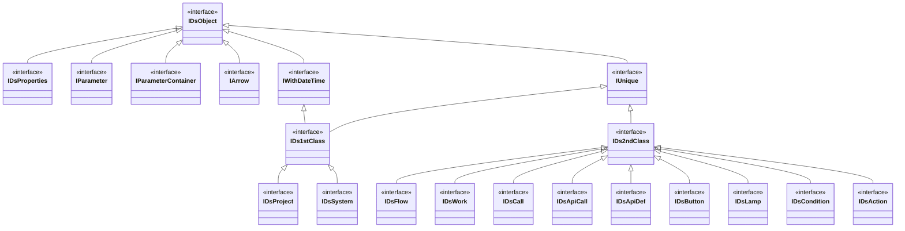
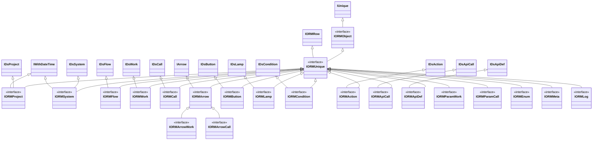
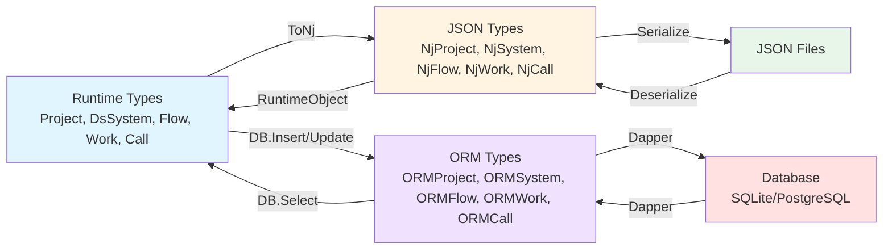

# Ev2.Core.FS Class Diagram

이 문서는 Ev2.Core.FS 프로젝트의 타입 상속 관계를 보여줍니다.

## 전체 타입 계층 구조

## Runtime 타입 계층 구조

```mermaid
classDiagram
    %% Runtime 인터페이스
    class IRtObject {
        <<interface>>
    }

    class IRtUnique {
        <<interface>>
    }

    class IRtParameter {
        <<interface>>
    }

    class IRtParameterContainer {
        <<interface>>
    }

    class IRtArrow {
        <<interface>>
    }

    class IRtProject {
        <<interface>>
    }

    class IRtSystem {
        <<interface>>
    }

    class IRtFlow {
        <<interface>>
    }

    class IRtWork {
        <<interface>>
    }

    class IRtCall {
        <<interface>>
    }

    class IRtApiCall {
        <<interface>>
    }

    class IRtApiDef {
        <<interface>>
    }

    IUnique <|-- IRtObject
    IRtObject <|-- IRtUnique
    IRtUnique <|-- IRtParameter
    IParameter <|-- IRtParameter
    IRtUnique <|-- IRtParameterContainer
    IParameterContainer <|-- IRtParameterContainer
    IRtUnique <|-- IRtArrow
    IArrow <|-- IRtArrow
    IRtUnique <|-- IRtProject
    IDsProject <|-- IRtProject
    IWithDateTime <|-- IRtProject
    IRtUnique <|-- IRtSystem
    IDsSystem <|-- IRtSystem
    IWithDateTime <|-- IRtSystem
    IRtUnique <|-- IRtFlow
    IDsFlow <|-- IRtFlow
    IRtUnique <|-- IRtWork
    IDsWork <|-- IRtWork
    IRtUnique <|-- IRtCall
    IDsCall <|-- IRtCall
    IRtUnique <|-- IRtApiCall
    IDsApiCall <|-- IRtApiCall
    IRtUnique <|-- IRtApiDef
    IDsApiDef <|-- IRtApiDef

    %% Runtime 구현 클래스
    class DisposableBase {
        <<abstract>>
    }

    class UniqueWithFody {
        <<abstract>>
        +PropertyChangedSubject
    }

    class Unique {
        <<abstract>>
        +Id: Id option
        +Name: string
        +Parameter: string
        +Guid: Guid
        +RawParent: Unique option
    }

    class RtUnique {
        <<abstract>>
        +ToNjObj() INjUnique
    }

    class JsonPolymorphic {
        <<abstract>>
        +ToJson() string
        +FromJson() T
        +DeepClone() T
    }

    DisposableBase <|-- UniqueWithFody
    UniqueWithFody <|-- Unique
    Unique <|-- RtUnique
    IUnique <|.. Unique
    IRtUnique <|.. RtUnique
    RtUnique <|-- JsonPolymorphic

    %% Entity 기반 클래스들
    class ProjectEntity {
        <<abstract>>
        +Project: Project option
    }

    class DsSystemEntity {
        <<abstract>>
        +System: DsSystem option
        +Project: Project option
    }

    class FlowEntity {
        <<abstract>>
        +Flow: Flow option
        +System: DsSystem option
        +Project: Project option
    }

    class WorkEntity {
        <<abstract>>
        +Work: Work option
        +System: DsSystem option
        +Project: Project option
    }

    class CallEntity {
        <<abstract>>
        +Call: Call option
        +Work: Work option
        +System: DsSystem option
        +Project: Project option
    }

    RtUnique <|-- ProjectEntity
    RtUnique <|-- DsSystemEntity
    ISystemEntity <|.. DsSystemEntity
    RtUnique <|-- FlowEntity
    RtUnique <|-- WorkEntity
    RtUnique <|-- CallEntity

    %% 메인 도메인 클래스들
    class Project {
        +ActiveSystems: DsSystem list
        +PassiveSystems: DsSystem list
        +Properties: ProjectProperties
    }

    class DsSystem {
        +Flows: Flow list
        +Works: Work list
        +Arrows: ArrowBetweenWorks list
        +ApiDefs: ApiDef list
        +ApiCalls: ApiCall list
        +Entities: BLCABase seq
        +Properties: DsSystemProperties
    }

    class Flow {
        +Properties: FlowProperties
        +Works: Work[]
    }

    class Work {
        +Calls: Call list
        +Arrows: ArrowBetweenCalls list
        +Properties: WorkProperties
        +FlowGuid: Guid option
    }

    class Call {
        +AutoConditions: ApiCallValueSpecs
        +CommonConditions: ApiCallValueSpecs
        +Properties: CallProperties
    }

    class ApiCall {
        +ValueSpec: IValueSpec option
        +IOTags: IOTagsWithSpec
        +Properties: ApiCallProperties
        +ApiDef: ApiDef
    }

    class ApiDef {
        +Properties: ApiDefProperties
        +TX: Work
        +RX: Work
    }

    class ArrowBetweenWorks {
        +XSourceGuid: Guid
        +XTargetGuid: Guid
        +Type: DbArrowType
        +Source: Work
        +Target: Work
    }

    class ArrowBetweenCalls {
        +XSourceGuid: Guid
        +XTargetGuid: Guid
        +Type: DbArrowType
        +Source: Call
        +Target: Call
    }

    RtUnique <|-- Project
    IRtProject <|.. Project
    IParameterContainer <|.. Project
    ProjectEntity <|-- DsSystem
    IRtSystem <|.. DsSystem
    IParameterContainer <|.. DsSystem
    DsSystemEntity <|-- Flow
    IRtFlow <|.. Flow
    DsSystemEntity <|-- Work
    IRtWork <|.. Work
    WorkEntity <|-- Call
    IRtCall <|.. Call
    DsSystemEntity <|-- ApiCall
    IRtApiCall <|.. ApiCall
    DsSystemEntity <|-- ApiDef
    IRtApiDef <|.. ApiDef
    DsSystemEntity <|-- ArrowBetweenWorks
    IRtArrow <|.. ArrowBetweenWorks
    WorkEntity <|-- ArrowBetweenCalls
    IRtArrow <|.. ArrowBetweenCalls

    %% BLCA 관련 클래스들
    class BLCABase {
        <<abstract>>
        +IOTags: IOTagsWithSpec
        +Flows: ResizeArray~IRtFlow~
    }

    class DsButton {
        +Properties: ButtonProperties
    }

    class Lamp {
        +Properties: LampProperties
    }

    class DsCondition {
        +Properties: ConditionProperties
    }

    class DsAction {
        +Properties: ActionProperties
    }

    JsonPolymorphic <|-- BLCABase
    IWithTagWithSpecs <|.. BLCABase
    BLCABase <|-- DsButton
    BLCABase <|-- Lamp
    BLCABase <|-- DsCondition
    BLCABase <|-- DsAction

    %% Properties 클래스들
    class DsPropertiesBase {
        <<abstract>>
    }

    class ProjectProperties {
        +Database: DbProvider
        +AasxPath: string
        +Author: string
        +Version: Version
    }

    class DsSystemProperties {
        +Author: string
        +EngineVersion: Version
        +LangVersion: Version
    }

    class FlowProperties {
        +FlowMemo: string
    }

    class WorkProperties {
        +Motion: string
        +Script: string
        +IsFinished: bool
    }

    class CallProperties {
        +CallType: DbCallType
        +IsDisabled: bool
        +ApiCallGuids: ResizeArray~Guid~
    }

    class ApiCallProperties {
        +ApiDefGuid: Guid
        +InAddress: string
        +OutAddress: string
    }

    class ApiDefProperties {
        +IsPush: bool
        +TxGuid: Guid
        +RxGuid: Guid
    }

    class ButtonProperties {
        +ButtonMemo: string
    }

    class LampProperties {
        +LampMemo: string
    }

    class ConditionProperties {
        +ConditionMemo: string
    }

    class ActionProperties {
        +ActionMemo: string
    }

    JsonPolymorphic <|-- DsPropertiesBase
    IDsProperties <|.. DsPropertiesBase
    DsPropertiesBase <|-- ProjectProperties
    DsPropertiesBase <|-- DsSystemProperties
    DsPropertiesBase <|-- FlowProperties
    DsPropertiesBase <|-- WorkProperties
    DsPropertiesBase <|-- CallProperties
    DsPropertiesBase <|-- ApiCallProperties
    DsPropertiesBase <|-- ApiDefProperties
    DsPropertiesBase <|-- ButtonProperties
    DsPropertiesBase <|-- LampProperties
    DsPropertiesBase <|-- ConditionProperties
    DsPropertiesBase <|-- ActionProperties
```

## Newtonsoft JSON 타입 계층 구조

```mermaid
classDiagram
    %% JSON 인터페이스
    class INjObject {
        <<interface>>
    }

    class INjUnique {
        <<interface>>
    }

    class INjProject {
        <<interface>>
    }

    class INjSystem {
        <<interface>>
    }

    class INjFlow {
        <<interface>>
    }

    class INjWork {
        <<interface>>
    }

    class INjCall {
        <<interface>>
    }

    class INjApiCall {
        <<interface>>
    }

    class INjApiDef {
        <<interface>>
    }

    class INjArrow {
        <<interface>>
    }

    class INjButton {
        <<interface>>
    }

    class INjLamp {
        <<interface>>
    }

    class INjCondition {
        <<interface>>
    }

    class INjAction {
        <<interface>>
    }

    IUnique <|-- INjObject
    INjObject <|-- INjUnique
    INjUnique <|-- INjProject
    IDsProject <|-- INjProject
    IWithDateTime <|-- INjProject
    INjUnique <|-- INjSystem
    IDsSystem <|-- INjSystem
    IWithDateTime <|-- INjSystem
    INjUnique <|-- INjFlow
    IDsFlow <|-- INjFlow
    INjUnique <|-- INjWork
    IDsWork <|-- INjWork
    INjUnique <|-- INjCall
    IDsCall <|-- INjCall
    INjUnique <|-- INjApiCall
    IDsApiCall <|-- INjApiCall
    INjUnique <|-- INjApiDef
    IDsApiDef <|-- INjApiDef
    INjUnique <|-- INjArrow
    IArrow <|-- INjArrow
    INjUnique <|-- INjButton
    IDsButton <|-- INjButton
    INjUnique <|-- INjLamp
    IDsLamp <|-- INjLamp
    INjUnique <|-- INjCondition
    IDsCondition <|-- INjCondition
    INjUnique <|-- INjAction
    IDsAction <|-- INjAction

    %% JSON 구현 클래스
    class NjUnique {
        <<abstract>>
        +RuntimeObject: Unique
    }

    class NjProjectEntity {
        <<abstract>>
        +Project: NjProject option
    }

    class NjSystemEntity {
        <<abstract>>
        +System: NjSystem option
        +Project: NjProject option
    }

    Unique <|-- NjUnique
    INjUnique <|.. NjUnique
    NjUnique <|-- NjProjectEntity
    NjUnique <|-- NjSystemEntity
    ISystemEntity <|.. NjSystemEntity

    class NjProject {
        +ActiveSystems: NjSystem[]
        +PassiveSystems: NjSystem[]
        +Properties: ProjectProperties
    }

    class NjSystem {
        +Flows: NjFlow[]
        +Works: NjWork[]
        +Arrows: NjArrow[]
        +ApiDefs: NjApiDef[]
        +ApiCalls: NjApiCall[]
        +Properties: DsSystemProperties
    }

    class NjFlow {
        +Properties: FlowProperties
    }

    class NjWork {
        +Calls: NjCall[]
        +Arrows: NjArrow[]
        +Properties: WorkProperties
        +FlowGuid: string
    }

    class NjCall {
        +AutoConditions: string
        +CommonConditions: string
        +Properties: CallProperties
    }

    class NjApiCall {
        +ValueSpec: string
        +IOTags: IOTagsWithSpec
        +Properties: ApiCallProperties
    }

    class NjApiDef {
        +Properties: ApiDefProperties
    }

    class NjArrow {
        +Source: string
        +Target: string
        +Type: string
    }

    NjUnique <|-- NjProject
    INjProject <|.. NjProject
    NjProjectEntity <|-- NjSystem
    INjSystem <|.. NjSystem
    NjSystemEntity <|-- NjFlow
    INjFlow <|.. NjFlow
    NjSystemEntity <|-- NjWork
    INjWork <|.. NjWork
    NjUnique <|-- NjCall
    INjCall <|.. NjCall
    NjSystemEntity <|-- NjApiCall
    INjApiCall <|.. NjApiCall
    NjSystemEntity <|-- NjApiDef
    INjApiDef <|.. NjApiDef
    NjUnique <|-- NjArrow
    INjArrow <|.. NjArrow
```

## ORM 타입 계층 구조

## 타입 변환 관계

## 주요 패턴

### Triple Type System (3중 타입 시스템)
- **Runtime Types (IRt\*)**: 메모리에서 실행되는 비즈니스 객체
- **JSON Types (INj\*)**: Newtonsoft.Json 직렬화용 객체
- **ORM Types (IORM\*)**: 데이터베이스 매핑 객체

### Entity 패턴
각 계층별로 Entity 기반 클래스가 있어 부모 참조를 쉽게 탐색할 수 있습니다:
- **ProjectEntity**: Project 참조
- **DsSystemEntity**: System, Project 참조
- **FlowEntity**: Flow, System, Project 참조
- **WorkEntity**: Work, System, Project 참조
- **CallEntity**: Call, Work, System, Project 참조

### Properties 패턴
각 도메인 객체는 별도의 Properties 클래스로 속성을 관리:
- JsonPolymorphic을 상속하여 동적 타입 직렬화 지원
- 확장 시스템을 통해 Third Party가 Properties를 확장 가능

### Polymorphic Collection
- `PolymorphicJsonCollection<T>`: 다형성 객체를 JArray로 직렬화
- Button, Lamp, Condition, Action을 DsSystem.Entities에 저장
