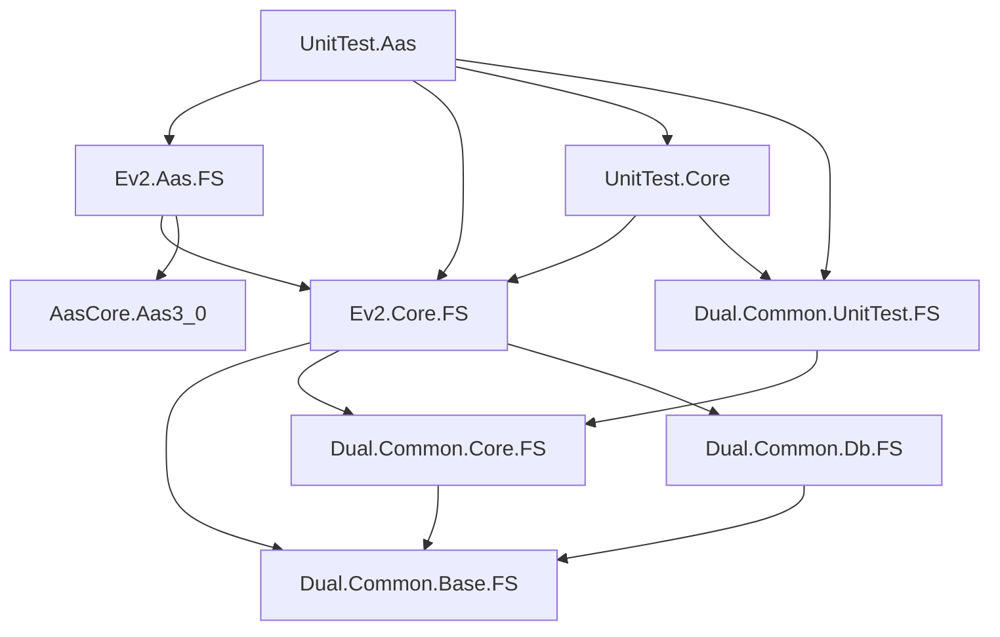

# DSEv2 프로젝트 의존성 분석 보고서

## 1. 프로젝트 구조 및 관계도

### 핵심 프로젝트 구조
```
dsev2.sln
├── engine/
│   ├── Ev2.Core.FS (netstandard2.0)          # 핵심 도메인 모델
│   └── Ev2.Aas.FS (net9.0)                   # AAS 통합 레이어
├── unit-test/
│   ├── UnitTest.Core (net9.0)                # 핵심 기능 테스트
│   └── UnitTest.Aas (net9.0)                 # AAS 기능 테스트
└── submodules/nuget/Common/
    ├── Dual.Common.Base.FS (netstandard2.0)  # 기본 유틸리티
    ├── Dual.Common.Core.FS (netstandard2.0)  # 핵심 함수형 라이브러리
    ├── Dual.Common.Db.FS (netstandard2.0)    # 데이터베이스 추상화
    └── Dual.Common.UnitTest.FS (net7.0/8.0/9.0) # 테스트 유틸리티
```

### 프로젝트 간 참조 관계


## 2. NuGet 패키지 의존성 매트릭스

### 공통 의존성 패키지

| 패키지 | Ev2.Core.FS | Dual.Common.Base.FS | Dual.Common.Core.FS | Dual.Common.Db.FS | UnitTest 프로젝트들 |
|--------|-------------|-------------------|-------------------|------------------|------------------|
| **Newtonsoft.Json** | 13.0.3 | 13.0.3 | 13.0.3 | - | 13.0.3 |
| **System.Reactive** | 6.0.1 | 6.0.1 | 6.0.1 | 6.0.1 | - |
| **log4net** | 2.0.17 | 2.0.17 | 2.0.17 | 2.0.17 | - |
| **Dapper** | 2.1.35 | - | - | 2.1.35 | - |
| **FSharp.Core** | (기본) | 8.0.400 | 8.0.400 | (기본) | (기본) |

### 테스트 관련 패키지

| 패키지 | UnitTest.Core | UnitTest.Aas | Dual.Common.UnitTest.FS |
|--------|---------------|---------------|------------------------|
| **Microsoft.NET.Test.Sdk** | 17.11.0 | 17.11.0 | 17.11.0 |
| **FsUnit** | 6.0.0 | 6.0.0 | 6.0.0 |
| **FsUnit.xUnit** | 6.0.0 | 6.0.0 | 6.0.0 |
| **NUnit3TestAdapter** | 4.6.0 | 4.6.0 | - |
| **xunit** | - | - | 2.9.0 |

### 데이터베이스 관련 패키지 (Dual.Common.Db.FS)

| 패키지 | 버전 |
|--------|------|
| **Npgsql** | 8.0.7 |
| **System.Data.SQLite** | 1.0.119 |
| **System.Data.SqlClient** | 4.8.6 |
| **Dapper** | 2.1.35 |

### 특수 패키지

| 패키지 | 프로젝트 | 버전 | 용도 |
|--------|----------|------|------|
| **AasCore.Aas3_0** | Ev2.Aas.FS | 1.0.4 | Asset Administration Shell |
| **JsonSubTypes** | Dual.Common.Core.FS | 2.0.1 | JSON 다형성 직렬화 |
| **FSharp.Json** | Dual.Common.Core.FS | 0.4.1 | F# JSON 처리 |
| **UTF.Unknown** | Dual.Common.Base.FS | 2.5.1 | 문자 인코딩 감지 |

## 3. 버전 충돌 및 호환성 분석

### ⚠️ 주요 이슈

#### 1. **Target Framework 불일치**
- **Ev2.Core.FS**: `netstandard2.0` (구형)
- **Ev2.Aas.FS**: `net9.0` (최신)
- **문제**: AasCore.Aas3_0가 net8.0+ 요구로 인한 강제 업그레이드

#### 2. **호환성 양호**
- 모든 주요 NuGet 패키지가 동일 버전 사용
- Newtonsoft.Json 13.0.3으로 통일
- System.Reactive 6.0.1로 통일
- 테스트 프레임워크도 일관된 버전 사용

#### 3. **FSharp.Core 버전 관리**
- 명시적 버전 지정: 8.0.400 (양호)
- netstandard2.0과 net9.0 간 호환성 확보

## 4. 권장사항

### 🎯 우선순위 높음

#### 1. **Target Framework 통일**
```xml
<!-- 권장: 모든 라이브러리 프로젝트를 netstandard2.0에서 net8.0으로 업그레이드 -->
<TargetFramework>net8.0</TargetFramework>
```
- **이유**: AasCore.Aas3_0 호환성, 최신 .NET 기능 활용
- **영향**: 빌드 성능 향상, 최신 언어 기능 사용 가능

#### 2. **LangVersion 표준화**
```xml
<!-- 권장: F# 9.0으로 통일 (.NET 9 호환) -->
<LangVersion>9.0</LangVersion>
```

### 🎯 우선순위 중간

#### 3. **패키지 버전 관리 개선**
- `Directory.Build.props` 파일 생성으로 중앙 집중식 버전 관리
```xml
<Project>
  <PropertyGroup>
    <NewtonsoftJsonVersion>13.0.3</NewtonsoftJsonVersion>
    <SystemReactiveVersion>6.0.1</SystemReactiveVersion>
    <Log4NetVersion>2.0.17</Log4NetVersion>
    <DapperVersion>2.1.35</DapperVersion>
  </PropertyGroup>
</Project>
```

#### 4. **테스트 프레임워크 정리**
- xUnit과 NUnit 혼재 → xUnit으로 통일 권장
- FsUnit.xUnit 사용으로 일관성 확보

### 🎯 우선순위 낮음

#### 5. **불필요한 의존성 정리**
- System.Configuration.ConfigurationManager (UnitTest에서만 사용)
- coverlet.collector (사용되지 않음 확인 필요)

#### 6. **패키지 업데이트 검토**
- 현재 버전들이 비교적 최신이므로 당장 업그레이드 불필요
- 보안 패치 있을 때만 선별적 업데이트

## 5. 아키텍처 강점

### ✅ 잘 설계된 부분
1. **계층적 의존성**: Base → Core → Domain 순서로 명확한 계층 구조
2. **공통 라이브러리**: Dual.Common.* 시리즈로 코드 재사용성 확보
3. **테스트 격리**: 별도 테스트 프로젝트로 관심사 분리
4. **버전 일관성**: 대부분의 패키지가 동일 버전 사용

### 📊 의존성 복잡도: **중간**
- 전체적으로 잘 관리되고 있음
- 순환 참조 없음
- 명확한 레이어 구조 유지

## 6. 결론

현재 프로젝트의 의존성 구조는 전반적으로 양호하며, Target Framework 통일만 해결하면 더욱 견고한 아키텍처가 될 것입니다.

---
*분석 일시: 2025-07-29*  
*분석 범위: dsev2.sln 메인 솔루션 및 하위 프로젝트*