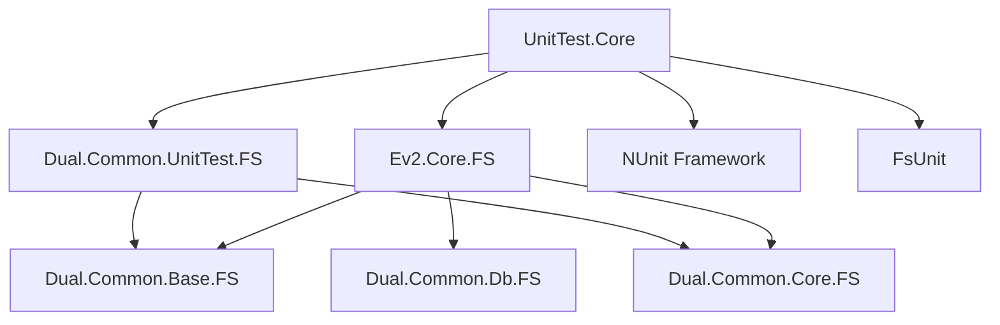

# UnitTest.Core

## 프로젝트 개요
- **이름**: UnitTest.Core
- **타입**: F# 테스트 프로젝트 
- **프레임워크**: .NET 9.0
- **역할**: Ev2.Core.FS 핵심 엔진의 단위 테스트
- **테스트 프레임워크**: NUnit, FsUnit, xUnit
- **생성일**: DS Engine Version 2 개발 중
- **언어**: F# (.NET 9.0)

Ev2.Core.FS 엔진의 핵심 기능에 대한 포괄적인 단위 테스트를 수행합니다. 산업 자동화 시스템의 도메인 모델(Project, DsSystem, Work, Call), 데이터베이스 영속성, JSON 직렬화/역직렬화, 객체 복제 등 모든 핵심 기능을 검증합니다.

## 의존성 정보

### TargetFramework
```xml
<TargetFramework>net9.0</TargetFramework>
<IsPackable>false</IsPackable>
<GenerateProgramFile>false</GenerateProgramFile>
<IsTestProject>true</IsTestProject>
```

### PackageReference
```xml
<PackageReference Include="Microsoft.NET.Test.Sdk" Version="17.11.0" />
<PackageReference Include="FsUnit" Version="6.0.0" />
<PackageReference Include="FsUnit.xUnit" Version="6.0.0" />
<PackageReference Include="NUnit3TestAdapter" Version="4.6.0" />
```

### ProjectReference
```xml
<ProjectReference Include="..\..\..\submodules\nuget\Common\Dual.Common.UnitTest.FS\Dual.Common.UnitTest.FS.fsproj" />
<ProjectReference Include="..\..\engine\Ev2.Core.FS\Ev2.Core.FS.fsproj" />
```

### 설정 파일
```xml
<Content Include="..\..\engine\Ev2.Core.FS\appSettings.json" Link="appSettings.json">
    <CopyToOutputDirectory>Always</CopyToOutputDirectory>
</Content>
<None Include="..\..\engine\Ev2.Core.FS\appSettings.json.template" Link="appSettings.json.template" />
```

## 파일 구조

```
UnitTest.Core/
├── UnitTest.Core.fsproj       # 프로젝트 파일
├── Program.fs                 # 진입점
├── TestHelpers.fs             # 테스트 유틸리티 헬퍼
├── Duplicate.Test.fs          # 중복 처리 테스트
├── ValueSpec.Test.fs          # 값 사양 테스트
│
├── model/                     # 도메인 모델 테스트
│   ├── CreateSample.fs                    # 기본 샘플 데이터 생성
│   ├── CreateSample.WithCylinders.fs      # 실린더 포함 샘플 생성
│   ├── CreateSample.HelloDS.fs            # HelloDS 샘플 생성
│   └── TestHelloDS.fs                     # HelloDS 테스트
│
├── database/                  # 데이터베이스 테스트
│   ├── Schema.Test.fs                     # 스키마 테스트
│   ├── ReadFromDB.Test.fs                 # DB 읽기 테스트
│   └── SystemImportExport.Test.fs         # 시스템 가져오기/내보내기 테스트
│
├── newtonsoft.json/          # JSON 직렬화 테스트
│   └── FSharpOption.Test.fs               # F# Option 타입 JSON 테스트
│
├── test-data/                # 테스트 데이터 디렉토리
│   ├── *.sqlite3                          # SQLite 테스트 DB 파일들
│   ├── *.json                             # JSON 테스트 데이터 파일들
│   └── ...                                # 기타 테스트 데이터
│
├── bin/                      # 빌드 출력
└── obj/                      # 빌드 임시 파일
```

## 주요 컴포넌트

### 핵심 네임스페이스
- **T**: 메인 테스트 네임스페이스
- **T.TestHelpers**: 테스트 유틸리티 모듈
- **T.CreateSampleModule**: 샘플 데이터 생성 모듈

### 테스트 카테고리

#### 1. 모델 테스트 (`model/`)
- **CreateSample.fs**: 기본 샘플 프로젝트 생성
  - Project, DsSystem, Flow, Work, Call 계층 구조 생성
  - ApiDef, ApiCall 정의 및 연결
  - ArrowBetweenWorks, ArrowBetweenCalls 화살표 관계
  - Button, Lamp, Condition, Action UI 요소

- **CreateSample.WithCylinders.fs**: 실린더 확장 샘플
- **CreateSample.HelloDS.fs**: HelloDS 기본 시나리오
- **TestHelloDS.fs**: HelloDS 검증 테스트

#### 2. 데이터베이스 테스트 (`database/`)
- **Schema.Test.fs**: 데이터베이스 스키마 생성 및 검증
  - SQLite, PostgreSQL 지원
  - 글로벌 테스트 설정 (`GlobalTestSetup`)
  - ModuleInitializer 호출

- **ReadFromDB.Test.fs**: 데이터베이스 읽기 작업 테스트
- **SystemImportExport.Test.fs**: 시스템 가져오기/내보내기

#### 3. 직렬화 테스트 (`newtonsoft.json/`)
- **FSharpOption.Test.fs**: F# Option 타입의 JSON 직렬화/역직렬화

#### 4. 핵심 기능 테스트
- **Duplicate.Test.fs**: 런타임 객체 복제 기능 검증
- **ValueSpec.Test.fs**: 값 명세 파싱 및 문자열 변환 테스트
  - Single, Multiple, Ranges 값 명세 타입
  - IValueSpec 인터페이스 구현

### 테스트 유틸리티 (`TestHelpers.fs`)

#### 파일 경로 생성 함수
```fsharp
// 테스트 데이터 디렉토리
testDataDir() : string

// 고유한 테스트 파일 경로 생성
getUniqueTestPath : string -> string -> string
getUniqueTestPathWithGuid : string -> string -> string
getUniquePathByTime : string -> string
getUniquePathByGuid : string -> string

// 특정 포맷 파일 경로
getUniqueSqlitePath() : string
getUniqueAasxPath() : string  
getUniqueJsonPath() : string
```

#### 정리 함수
```fsharp
// 테스트 파일 정리
cleanupTestFile : string -> unit
cleanupTestFiles : string list -> unit
```

### 샘플 데이터 생성

#### 주요 런타임 객체들
```fsharp
let mutable rtProject : Project
let mutable rtSystem : DsSystem
let mutable rtFlow : Flow
let mutable rtWork1, rtWork2, rtWork3 : Work
let mutable rtCall1a, rtCall1b, rtCall2a, rtCall2b : Call
let mutable rtApiDef1, rtApiDef2 : ApiDef
let mutable rtApiCall1a, rtApiCall1b : ApiCall
```

#### 계층적 구조
- **Project** (MainProject)
  - **DsSystem** (MainSystem)
    - **Flow** (MainFlow) - UI 요소들 포함
    - **Work** (BoundedWork1, BoundedWork2, FreeWork1)
      - **Call** (Call1a, Call1b, Call2a, Call2b)
    - **ApiDef** (ApiDef1a, UnusedApi)
    - **ApiCall** (ApiCall1a, ApiCall1b)

## 테스트 데이터

### SQLite 데이터베이스 파일
- 다양한 시나리오별 `.sqlite3` 파일들
- 실린더, DB 삽입/수정, 중복 생성 등 테스트 케이스

### JSON 테스트 파일  
- 직렬화/역직렬화 검증용 JSON 파일들
- DsSystem, Project 등 모든 객체 타입의 JSON 표현

## 빌드 명령어

### 프로젝트 빌드
```bash
# UnitTest.Core 프로젝트 빌드
dotnet build UnitTest.Core.fsproj

# Release 모드 빌드
dotnet build UnitTest.Core.fsproj --configuration Release

# 상세 출력으로 빌드  
dotnet build UnitTest.Core.fsproj --verbosity detailed
```

### 테스트 실행
```bash
# 모든 테스트 실행
dotnet test UnitTest.Core.fsproj

# 특정 테스트 클래스 실행
dotnet test UnitTest.Core.fsproj --filter "TestClass=DuplicateTestModule"

# 상세 출력으로 테스트
dotnet test UnitTest.Core.fsproj --verbosity normal

# 코드 커버리지 포함
dotnet test UnitTest.Core.fsproj --collect:"XPlat Code Coverage"
```

### 솔루션 레벨 명령어
```bash
# 전체 dsev2 솔루션에서 테스트 실행
cd ../../
dotnet test dsev2.sln

# 특정 프로젝트만 테스트
dotnet test dsev2.sln --filter "FullyQualifiedName~UnitTest.Core"
```

## 설정 및 초기화

### GlobalTestSetup
- **OneTimeSetUp**: ModuleInitializer 호출, 로깅 활성화, 테스트 데이터 디렉토리 생성
- **OneTimeTearDown**: 테스트 종료 후 정리 작업

### 데이터베이스 지원
- **SQLite**: 로컬 파일 기반 테스트
- **PostgreSQL**: 서버 기반 테스트 (localhost:5432)

### 로깅 설정
- **DcLogger.EnableTrace**: 상세 추적 로그 활성화
- **AppSettings**: UTC 시간 비활성화 설정

## 테스트 패턴

### F# 테스트 특징
- FsUnit 사용으로 F# 친화적 어설션: `===` 연산자
- 불변성 기반 객체 생성 및 검증
- `|> tee` 패턴을 통한 객체 초기화

### 테스트 격리
- 각 테스트별 고유한 파일 경로 생성
- GUID 기반 임시 파일명 생성
- 테스트 종료 시 자동 정리

### 검증 패턴
```fsharp
// FsUnit 어설션
result === expected

// 런타임 객체 검증
edObj.Id.IsNone === true
rtProject.EnumerateRtObjects() |> validate
```

## 의존성 관계



## 주요 테스트 시나리오

1. **객체 생성 및 계층 구조**: Project → System → Work → Call 생성
2. **관계 설정**: Arrow 연결, ApiCall 매핑, Flow 연결
3. **데이터베이스 영속성**: SQLite/PostgreSQL CRUD 작업
4. **JSON 직렬화**: 런타임 객체 ↔ JSON 변환
5. **객체 복제**: Deep copy 기능 검증
6. **값 명세 파싱**: ValueSpec 문자열 파싱 및 검증

## 문제 해결

### 일반적인 문제
- **데이터베이스 연결 실패**: PostgreSQL 서버 상태 확인
- **테스트 데이터 충돌**: 고유 파일명 생성 함수 사용
- **모듈 초기화 오류**: GlobalTestSetup에서 ModuleInitializer 호출 확인

### 디버깅 팁
- `DcLogger.EnableTrace = true`로 상세 로그 활성화
- test-data 디렉토리의 생성된 파일들로 중간 결과 확인
- FsUnit 어설션 메시지로 실패 원인 파악

## 관련 프로젝트
- **Ev2.Core.FS**: 테스트 대상 핵심 엔진
- **UnitTest.Aas**: AAS 통합 테스트
- **Dual.Common.UnitTest.FS**: 공통 테스트 유틸리티
- **Dual.Common.Db.FS**: 데이터베이스 계층

## 주의사항
- 테스트 실행 시 test-data 디렉토리에 다수의 SQLite 및 JSON 파일이 생성됩니다
- 병렬 테스트 실행을 위해 각 테스트는 고유한 파일명을 사용합니다
- PostgreSQL 테스트는 로컬 서버(localhost:5432) 연결이 필요합니다
- 테스트 종료 후 임시 파일들은 자동으로 정리되지만, test-data 디렉토리는 주기적으로 확인하세요